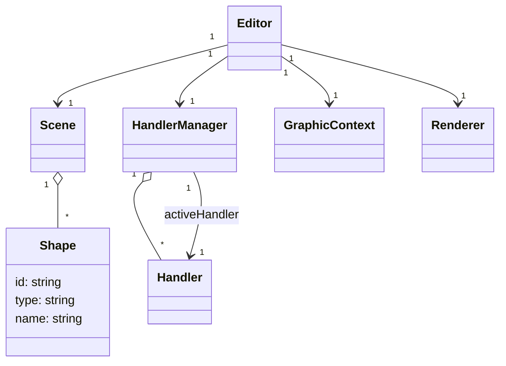

# Bitmap Editor



## Shapes

- `Line`, `Rectangle`, `Circle`, `Polygon`, `Text`
- `Pixels`는 여러 픽셀을 하나의 Shape로 묶어서 관리할 수 있음. (마우스로 한번에 그림 픽셀들은 하나의 `Pixels` Shape로 묶임)
- 각 도형은 class 가 아닌 JSON object 형태로 저장됨. (Shape type에 따라 다른 속성을 가짐)

```ts
interface Shape {
  type: string;
  color: number;
}

interface Line extends Shape {
  type: "line";
  x0: number;
  y0: number;
  x1: number;
  y1: number;
}

interface Rectangle extends Shape {
  type: "rectangle";
  x: number;
  y: number;
  width: number;
  height: number;
  radius: number;
}

interface Ellipse extends Shape {
  type: "ellipse";
  x: number;
  y: number;
  width: number;
  height: number;
}

interface Polygon extends Shape {
  type: "polygon";
  points: [][];
}

interface Pixels extends Shape {
  type: "pixels";
  pixels: [][];
}
```

## Rendering

## Interaction

- Canvas에서 마우스 이벤트 발생시 --> 비트맵 좌표로 변환

```ts
class GraphicBuffer {
  buffer: Uint8Array; // W * H * colors
  width: number;
  height: number;
  put(x, y, color: number);
  get(x, y): number;
}

class Page {
  shapes: Shape[];
}

class Project {
  pages: Page[];
}

class Editor {
  canvas: HTMLCanvasElement;
  buffer: GraphicBuffer;
  handlers: Handlers;
  render() {}
}
```
